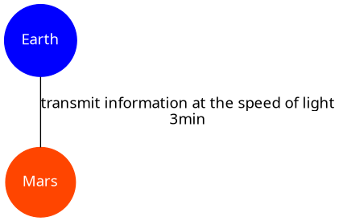
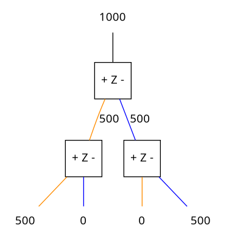
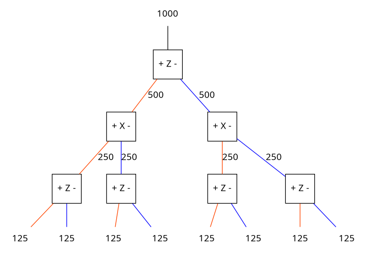

# Free Will Theorem

Developed by John Horton Conway and Simon Bernhard Kochen

## Axioms

The theorem relies on three axioms, namely: __FIN__, __SPIN__, __TWIN__

Later they revised (or strengthened the theorem) by replacing __FIN__ with __MIN__, we will ignore this and use the axiom __FIN__ instead since it is easier to remember and explain.

### FIN

FIN roughly speaking stands for finite. It is based on the theory (stronger word her?!) that information can not travel faster than the speed of light (299792458 m/s; approximately 300000 km/s).

So the propagation of information is always bound to be at a maximum speed (the speed of light), for example when transferring any kind of information from planet Earth to planet Mars it would take just around 3 minutes to reach its destiny.

### SPIN

In quantum mechanics and particle physics __spin__ is an intrinsic form of angular momentum.

This spin component when squared can be described with a set of three 1s and 0s; whereas it will _always_ have two 1s and one 0, thus it is always a permutation of (1,1,0) (i.e. (1,0,1) or (0,1,1)).

_this part needs some more explanation - i don’t understand where this 101 rule comes from_

The spin of the particle is not determined until we actually measure it; this can be explained with the __Stern-Gerlach experiment__ ([Medium](https://medium.com/@notaredpanda/the-essence-of-quantum-mechanics-part-1-measurement-and-spin-cec98216c8)).
Briefly explained: 

* sending a beam of neutral silver atoms through an inhomogeneous magnetic field will split the beam into two (very evenly)
* this can be done for the X and Z axis (by adjusting the magnetic field)
* when sending the beam through a Z axis measurement it will evenly divide the beam, adding another Z axis measurement will result in one beam (since it has been split before)

* and when measuring first the Z axis, then the X axis and then the Z axis - the beam will be split evenly at each point of measurement

  * thus we can say that the measurement of one axis let’s the particle reset its state (or forget the previous measurement)

  

**Measuring Z in sequence:**

**Measuring Z and X alternating:**

_Conclusion: observing a quantum mechanical system changes the system - so it is never predictable in which state the system is until we measure it; it is not determinable._

(When this happens, we say that the component of the spin in the *z* direction and the component of the spin in the *x* direction are incompatible observables: it is not possible to know both of their values at the same time.)

### TWIN

It is possible to entangle two particles so even when they are separated by far distance they give the same result when measured in parallel directions.

So speaking the ‘information’ of these two particles will be ‘synchronized’ - measuring direction A will give 0 or 1 (as spin) and the entangled particle will always have the same spin (0 or 1) in that direction.

## Theorem

Now let us assume we have an entangled particle which gets observed by two independent scientists. One of them is doing the experiment on Earth and the other is doing the same experiment on Mars. They do not have to choose the same axis to measure, that is up to the independent scientists to choose by their own freedom.
Let us remember, information would require at least 3 minutes to go from Earth to Mars (or vice versa) - **FIN** - and both particles are in an entangled state - **TWIN** - also the result of the observation is not predetermined, it is only ‘decided’ by the particle as soon as we start measuring - **SPIN**.

It is not possible for any information to be transferred fast enough between the two particles (due to the vast distance) it is impossible for them to synchronize by exchange of information. Yet they still give the same result and this result is not determined until we measure.

Hence the particle does not rely on any events that happened before - no determination - and it is independent of the location, the choice is just made up on the spot at the moment of measurement; until then the particle did not decide what state it is in. This is the free will exercised by the particle.